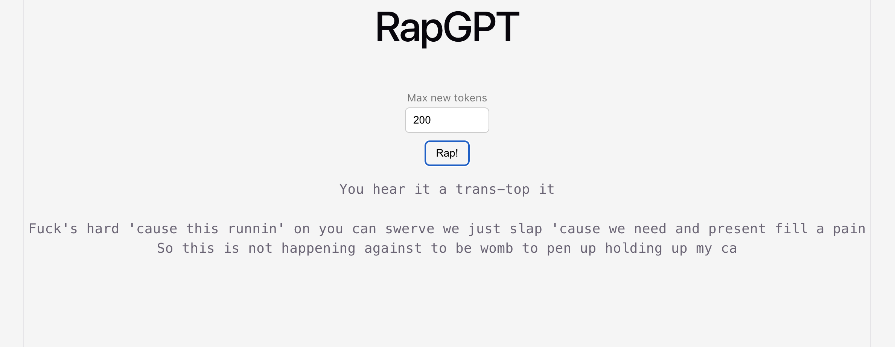

# rapgpt


<table align="center">
  <tr>
    <td align="center">
      
    </td>
    <td align="center">
      
    </td>
  </tr>
</table>

Character-level decoder-only [Transformer](https://arxiv.org/pdf/1706.03762) (no cross-attention) trained on Eminem songs using [this](https://www.kaggle.com/datasets/thaddeussegura/eminem-lyrics-from-all-albums/data) dataset.

## Features

- Generate rap lyrics based on user specified token count
- Configurable maximum number of generated tokens

## Project Structure

backend/
- train.py – trains the Transformer model
- inference.py – loads the trained model for inference
- model_weights.pth – pretrained model weights

frontend/
- React application

## Requirements
- Python 3.8 or newer
- PyTorch
- Fast API
- Node.js
- React

## Usage

### clone the repository:
```
git clone https://github.com/nithinbharathi/rapgpt.git
cd rapgpt
```
### Run backend:
```
cd backend
python -m env env
pip install torch fastapi uvicorn
```

### Run frontend:
```
cd frontend
npm install
npm run dev
```

## Pretrained Model

The repository already includes `backend/model_weights.pth`, so you can run the application immediately without training the model.

## Training (Optional)

If you'd like to train the model yourself,

```bash
cd backend
python train.py
```

The trained model will be saved as

```
model_weights.pth
```

which is automatically loaded by the backend during inference.

## Screenshots

<div align="center">

<p><b>Figure 1: front end</b></p>
</div>


<div align="center">

<p><b>Figure 2: Model Loss over epochs</b></p>
</div>


Acknowledgements
-----------------
Inspired by Andrej Karpathy's nanoGPT and related educational resources.
