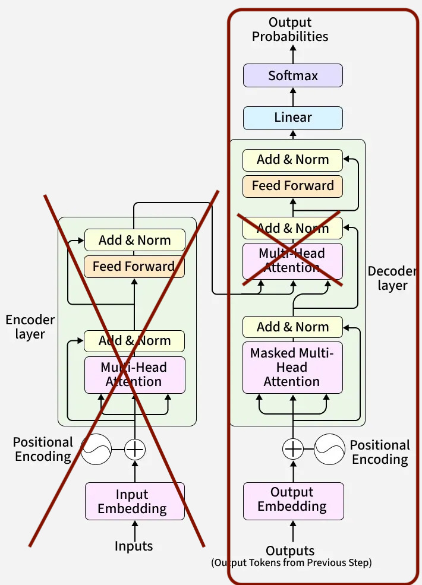

# rapgpt

Character-level decoder-only [Transformer](https://arxiv.org/pdf/1706.03762) (no cross-attention) trained on Eminem songs using the [kaggle](https://www.kaggle.com/datasets/thaddeussegura/eminem-lyrics-from-all-albums/data) dataset.

<div align="center">
  
  
</div>


Repository layout
-----------------
- `ALL_eminem.txt`: raw text dataset.
- `inference.py`: inference CLI/entrypoint.
- `train.py`: training CLI/entrypoint.
- `model.py`: model architecture and utility functions.

Requirements
------------
- Python 3.8 or newer.
- PyTorch

Usage
-----
- clone the repository `git clone https://github.com/nithinbharathi/rapgpt.git`
- `cd rapgpt`
- Run training: `python train.py`
- Run inference: `python inference.py`

<div align="center">

<p><b>Figure 1: Model Loss over epochs</b></p>
</div>


Sample output
--------------------------------
```
'Cause you're thinking that here?
And did I wanna from good good fantas
Madder for the always
Wird to the new lews happening
Having a lot my last fat stay

Hey Charm over some that Brendo Banda
The battle bat nest
Gets with my snate, it was stomach demost sent that ited Bandarrd sent. Crent in.
And I atell if my parts is leave me?
She's pet cleaning so hent.
Rry and developes I'm much pressing the cops on them in my he-rooms adde he don't.
"
Just throw up like a curse, gee crash, crew up, and sp
```

Acknowledgements
-------------------
Inspired by Andrej Karpathy's [nanoGPT](https://github.com/karpathy/nanoGPT) and his [youtube gpt lecture](https://www.youtube.com/watch?v=kCc8FmEb1nY).