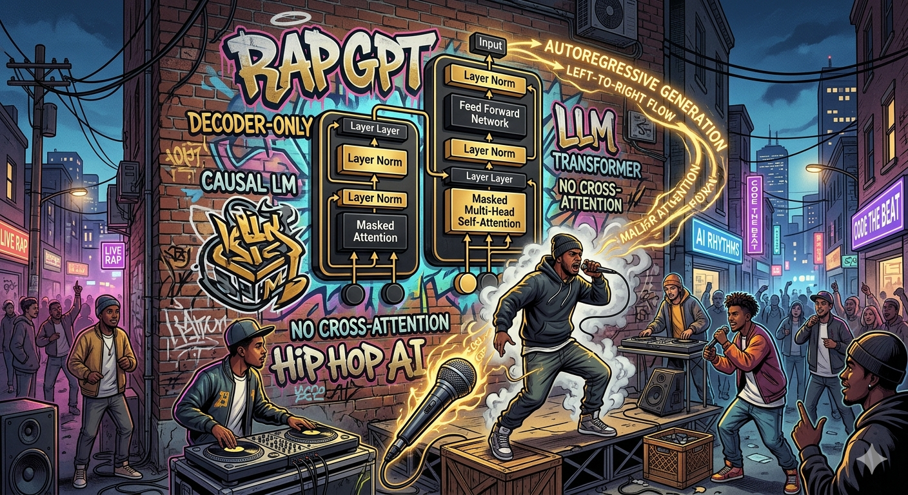
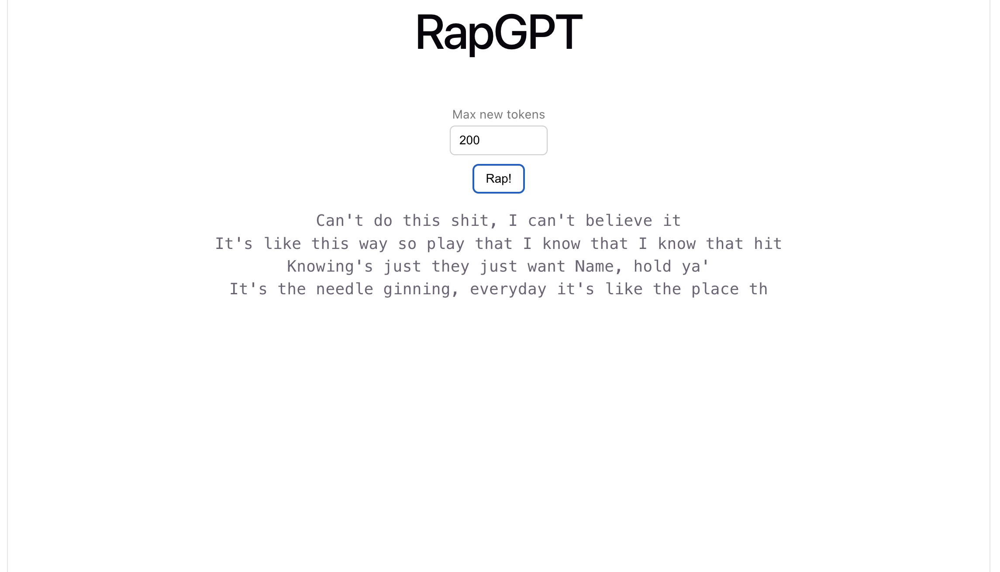
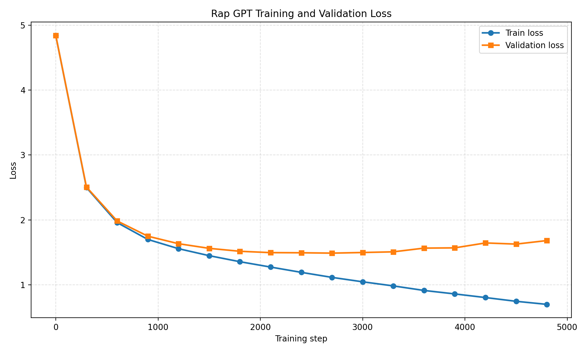

# rapgpt

<div align ="center">

</div>

Character-level decoder-only [Transformer](https://arxiv.org/pdf/1706.03762) (no cross-attention) trained on Eminem songs using [this](https://www.kaggle.com/datasets/thaddeussegura/eminem-lyrics-from-all-albums/data) dataset.


<div align="center">
  <div align="center">

</div>
</div>

Requirements
------------
- Python 3.8 or newer.
- PyTorch
- Fast API
- Node.js
- React

Usage
-----
### clone the repository:
```
git clone https://github.com/nithinbharathi/rapgpt.git
cd rapgpt
```
### Run backend:
```
cd backend
python -m env env
pip install torch
pip install fastapi
pip install uvicorn
```

### Run frontend:
```
cd frontend
npm install
npm run dev
```

<div align="center">

<p><b>Figure 2: front end</b></p>
</div>


<div align="center">

<p><b>Figure 1: Model Loss over epochs</b></p>
</div>


Acknowledgements
-------------------
Inspired by Andrej Karpathy's [nanoGPT](https://github.com/karpathy/nanoGPT) and his [youtube gpt lecture](https://www.youtube.com/watch?v=kCc8FmEb1nY).